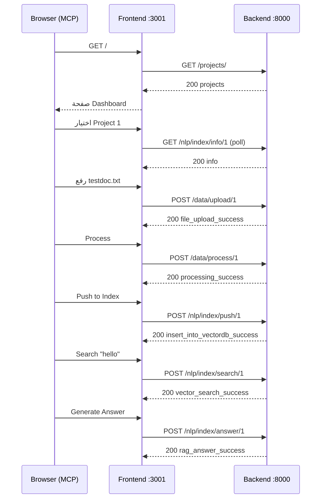

# Mini-RAG – End-to-End Frontend ✕ Backend Test Plan

> آخر تحديث: {{date}}

هذا المستند يوضح **جميع الخطوات التفصيلية** لاختبار تكامل واجهة المستخدم مع واجهة برمجة التطبيقات (API) طبقاً لملف `endpoints.md`.

---

## 1. المتطلبات المسبقة

| بند | قيمة |
| --- | --- |
| عنوان الباك-إند | `http://localhost:8000/api/v1` |
| عنوان الفرونت-إند | `http://localhost:3001` |
| المتصفح | أي متصفح حديث (يُفضّل Chrome) |
| أدوات الاختبار | أدوات **MCP Playwright** المدمجة + DevTools Network + لوج الباك-إند |

1. تأكد من تشغيل الباك-إند (`uvicorn main:app --reload --port 8000`).
2. شغّل الفرونت-إند (`npm run dev`) بحيث يعمل Vite على `3001`.
3. امسح **localStorage** أو اضبط المفتاح `useMockData` على `false` (تم إجبارياً فى الكود بعد التصحيح).

---

## 2. سيناريو الاختبار الأساسى (Happy Path)

> يغطى من اختيار مشروع إلى الحصول على إجابة RAG.

| # | صفحة | إجراء المستخدم | API المتوقع | استجابة متوقعة |
| - | ----- | -------------- | ----------- | --------------- |
| 1 | Dashboard | فتح الموقع لأول مرة | `GET /projects/` | قائمة المشاريع تظهر فى ProjectSelector |
| 2 | Header | اختيار مشروع موجود (ID = 1 مثلاً) | `GET /nlp/index/info/1` (متكرر) | لا أخطاء |
| 3 | Welcome API | `Try it` | `GET /` | `{app_name, app_version}` مع Toast نجاح |
| 4 | Upload | رفع ملف PDF/TXT | `POST /data/upload/1` | `file_upload_success` |
| 5 | Process | الضغط على **Process** | `POST /data/process/1` | `processing_success` + أرقام الملفات |
| 6 | Index → Push | **Push to Index** | `POST /nlp/index/push/1` `{do_reset:0}` | `insert_into_vectordb_success` |
| 7 | Index → Info | تبويب **Index Info** | `GET /nlp/index/info/1` | record_count > 0، status = Active |
| 8 | Search | إدخال استعلام والضغط Search | `POST /nlp/index/search/1` | `vector_search_success` مع قائمة النتائج |
| 9 | Search | **Generate Answer** | `POST /nlp/index/answer/1` | `rag_answer_success` مع `answer` و `sources` |
| 10 | Q&A | طرح سؤال جديد | `POST /nlp/index/answer/1` | رد ظاهر فى المحادثة |

### التحقق
* راقب Network فى DevTools أو لوج الباك-إند للتأكد من أن كل طلب يتم و status = 200.
* يجب ألا تظهر أى مسارات من نوع `%5Bobject Object%5D` بعد إصلاح `IndexPushPage`.

---

## 3. سيناريوهات الحواف (Edge Cases)

| الحالة | الإجراء | النتيجة المتوقعة |
| ------- | ------- | ---------------- |
| لا يوجد مشروع مُختار | حاول Upload / Process / Push / Search / Q&A | Toast خطأ "Please select a project" ولا يتم إرسال أى طلب |
| رفع ملف غير مسموح (مثلاً `.exe`) | اختر الملف | Toast خطأ, لا يُرسل الطلب |
| Process بدون ملفات مرفوعة | اضغط Process مباشرة | `400` → Toast "not_found_files" |
| Push بدون معالجة | اضغط Push | `422` أو `insert_into_vectordb_error`, Toast مناسب |
| Search قبل Push | حاول بحث | Toast يحذر بأن المشروع غير مُفهرس |
| سؤال فارغ فى Q&A | اضغط Send | الزر Disabled، لا يُرسل طلب |
| إعادة Push مع **Reset = ON** | فعّل المفتاح ثم Push | يقوم بحذف الفهرس ثم إنشائه ويعيد `insert_into_vectordb_success` |

---

## 4. أدوات MCP – خطوات آلية مختصرة



> يمكن تنفيذ الخطوات السابقة عبر أدوات MCP:
>
> ```
> # مثال رفع ملف
> mcp_browser_click   element="Upload" ref="…"
> mcp_browser_file_upload paths=["C:/path/file.txt"]
> ```

---

## 5. مراقبة وسجلات

* فعّل `Network ⇢ Preserve log` لمعرفة كل الطلبات.
* تأكد من ظهور `API Request:` و `API Response:` فى console (معترض axios).
* راقب لوج الباك-إند؛ يجب أن يُطابق جدول السيناريو الأساسى.

---

## 6. نجاح الاختبار

يُعتبر التكامل ناجحًا إذا تحققت الشروط التالية:

1. كل الخطوات فى السيناريو الأساسى تُكمل دون خطأ.
2. كل Edge Cases تُظهر رسائل الخطأ المناسبة ولا تُرسل طلبات خاطئة.
3. لا توجد أخطاء 422/500 فى الـ Network أو لوج الباك-إند أثناء المسار الأساسى.
4. واجهة المستخدم تُحدَّث (Toasts/نتائج) طبقًا لردّ الـ API.

---

> **ملاحظة**: عند إضافة ميزات جديدة أو Endpoints إضافية، حدّث هذا الملف وملف `endpoints.md` وفقاً لذلك. 