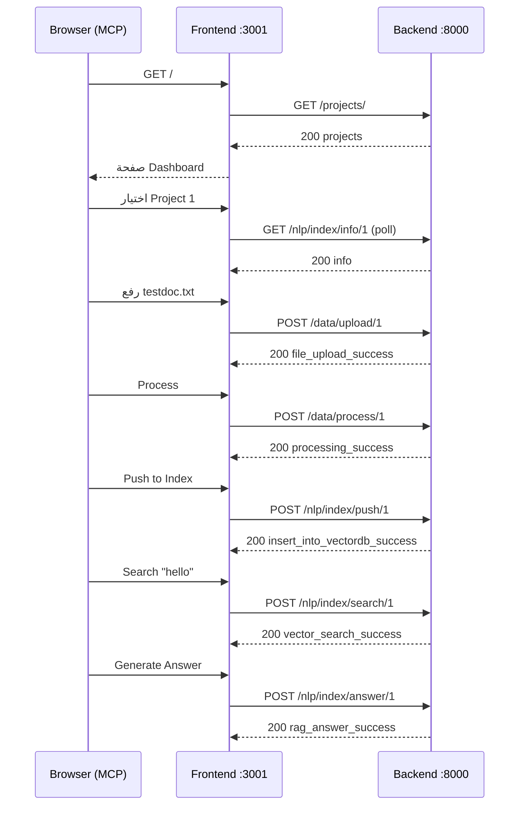

# Mini-RAG – End-to-End Frontend ✕ Backend Test Plan

> آخر تحديث: {{date}}

هذا المستند يوضح **جميع الخطوات التفصيلية** لاختبار تكامل واجهة المستخدم مع واجهة برمجة التطبيقات (API) طبقاً لملف `endpoints.md`.

---

## الهدف
اختبار تكامل الواجهة الأمامية مع الواجهة الخلفية للتأكد من أن الاتصال يعمل بشكل صحيح وأن البيانات تُعرض بشكل صحيح.

## المتطلبات المسبقة
1. تشغيل الواجهة الخلفية باستخدام الأمر `python -m src.main`
2. تشغيل الواجهة الأمامية باستخدام الأمر `cd frontend && npm run dev`

## خطوات الاختبار

### 1. اختبار اتصال الواجهة الأمامية بالواجهة الخلفية
- [x] التأكد من أن الواجهة الأمامية تعرض الصفحة الرئيسية بشكل صحيح
- [x] الانتقال إلى صفحة "Test Connection" والتحقق من أن الاتصال بالواجهة الخلفية يعمل بشكل صحيح
- [x] التحقق من أن الواجهة الأمامية تستخدم البيانات الحقيقية وليس البيانات الوهمية

### 2. اختبار إنشاء مشروع جديد
- [x] النقر على زر "Select a project" في الشريط العلوي
- [x] النقر على "Create Project" في القائمة المنسدلة
- [x] إدخال اسم المشروع "Test Project Fix"
- [x] النقر على زر "Create Project"
- [x] التحقق من أن المشروع تم إنشاؤه بنجاح وتم تحديده تلقائيًا

### 3. اختبار تحميل ملف PDF
- [x] الانتقال إلى صفحة "Upload"
- [x] سحب وإفلات ملف PDF أو النقر على المنطقة لاختيار ملف
- [x] التحقق من أن الملف تم تحميله بنجاح وظهر في قائمة الملفات المحملة

### 4. اختبار معالجة الملفات
- [x] الانتقال إلى صفحة "Process"
- [x] تحديد الملف الذي تم تحميله
- [x] النقر على زر "Process File"
- [x] التحقق من أن الملف تمت معالجته بنجاح

### 5. اختبار البحث في الملفات
- [x] الانتقال إلى صفحة "Search"
| # | صفحة | إجراء المستخدم | API المتوقع | استجابة متوقعة |
| - | ----- | -------------- | ----------- | --------------- |
| 1 | Dashboard | فتح الموقع لأول مرة | `GET /projects/` | قائمة المشاريع تظهر فى ProjectSelector |
| 2 | Header | اختيار مشروع موجود (ID = 1 مثلاً) | `GET /nlp/index/info/1` (متكرر) | لا أخطاء |
| 3 | Welcome API | `Try it` | `GET /` | `{app_name, app_version}` مع Toast نجاح |
| 4 | Upload | رفع ملف PDF/TXT | `POST /data/upload/1` | `file_upload_success` |
| 5 | Process | الضغط على **Process** | `POST /data/process/1` | `processing_success` + أرقام الملفات |
| 6 | Index → Push | **Push to Index** | `POST /nlp/index/push/1` `{do_reset:0}` | `insert_into_vectordb_success` |
| 7 | Index → Info | تبويب **Index Info** | `GET /nlp/index/info/1` | record_count > 0، status = Active |
| 8 | Search | إدخال استعلام والضغط Search | `POST /nlp/index/search/1` | `vector_search_success` مع قائمة النتائج |
| 9 | Search | **Generate Answer** | `POST /nlp/index/answer/1` | `rag_answer_success` مع `answer` و `sources` |
| 10 | Q&A | طرح سؤال جديد | `POST /nlp/index/answer/1` | رد ظاهر فى المحادثة |

### التحقق
* راقب Network فى DevTools أو لوج الباك-إند للتأكد من أن كل طلب يتم و status = 200.
* يجب ألا تظهر أى مسارات من نوع `%5Bobject Object%5D` بعد إصلاح `IndexPushPage`.

---

## 3. سيناريوهات الحواف (Edge Cases)

| الحالة | الإجراء | النتيجة المتوقعة |
| ------- | ------- | ---------------- |
| لا يوجد مشروع مُختار | حاول Upload / Process / Push / Search / Q&A | Toast خطأ "Please select a project" ولا يتم إرسال أى طلب |
| رفع ملف غير مسموح (مثلاً `.exe`) | اختر الملف | Toast خطأ, لا يُرسل الطلب |
| Process بدون ملفات مرفوعة | اضغط Process مباشرة | `400` → Toast "not_found_files" |
| Push بدون معالجة | اضغط Push | `422` أو `insert_into_vectordb_error`, Toast مناسب |
| Search قبل Push | حاول بحث | Toast يحذر بأن المشروع غير مُفهرس |
| سؤال فارغ فى Q&A | اضغط Send | الزر Disabled، لا يُرسل طلب |
| إعادة Push مع **Reset = ON** | فعّل المفتاح ثم Push | يقوم بحذف الفهرس ثم إنشائه ويعيد `insert_into_vectordb_success` |

---

## 4. أدوات MCP – خطوات آلية مختصرة



> يمكن تنفيذ الخطوات السابقة عبر أدوات MCP:
>
> ```
> # مثال رفع ملف
> mcp_browser_click   element="Upload" ref="…"
> mcp_browser_file_upload paths=["C:/path/file.txt"]
> ```

---

## 5. مراقبة وسجلات

* فعّل `Network ⇢ Preserve log` لمعرفة كل الطلبات.
* تأكد من ظهور `API Request:` و `API Response:` فى console (معترض axios).
* راقب لوج الباك-إند؛ يجب أن يُطابق جدول السيناريو الأساسى.

---

## 6. نجاح الاختبار

يُعتبر التكامل ناجحًا إذا تحققت الشروط التالية:

1. كل الخطوات فى السيناريو الأساسى تُكمل دون خطأ.
2. كل Edge Cases تُظهر رسائل الخطأ المناسبة ولا تُرسل طلبات خاطئة.
3. لا توجد أخطاء 422/500 فى الـ Network أو لوج الباك-إند أثناء المسار الأساسى.
4. واجهة المستخدم تُحدَّث (Toasts/نتائج) طبقًا لردّ الـ API.

---

> **ملاحظة**: عند إضافة ميزات جديدة أو Endpoints إضافية، حدّث هذا الملف وملف `endpoints.md` وفقاً لذلك. 

---

## 7. المشاكل المكتشفة والحلول

خلال عملية الاختبار، تم اكتشاف المشاكل التالية وتم تصحيحها:

### 7.1 مشكلة إغلاق مربع الحوار عند اختيار مشروع جديد

**المشكلة**: عند اختيار مشروع جديد من قائمة المشاريع، لا يتم إغلاق مربع الحوار تلقائيًا.

**السبب**: في `SimpleProjectSelector.tsx`، تم استخدام `setSelectedProject` مباشرة بدلاً من استخدام `selectProject` من سياق المشروع.

**الحل**: تم تعديل `SimpleProjectSelector.tsx` لاستخدام `selectProject` بدلاً من `setSelectedProject`، وإضافة إغلاق مربع الحوار عند اختيار المشروع.

### 7.2 مشكلة الطلبات المتكررة لمعلومات الفهرس

**المشكلة**: كانت هناك طلبات متكررة إلى `/api/v1/nlp/index/info/1` كل 5 ثوانٍ، مما يزيد الحمل على الخادم.

**السبب**: في `useIndexInfo.ts`، تم تعيين `refetchInterval: useMockData ? false : 5000`، مما يعني أنه يتم إعادة جلب المعلومات كل 5 ثوانٍ.

**الحل**: تم تعديل `useIndexInfo.ts` لإزالة الطلبات المتكررة عن طريق تعيين `refetchInterval: false` وزيادة `staleTime` إلى 60 ثانية.

**تحديث**: تم اكتشاف نسخة ثانية من `useIndexInfo` في `DashboardPage.tsx` كانت لا تزال تستخدم `refetchInterval: useMockData ? false : 5000`. تم تعديلها أيضًا لتستخدم `refetchInterval: false` و `staleTime: 60000`.

### 7.3 مشكلة عدم تحديث المشروع المحدد في واجهة المستخدم

**المشكلة**: عند اختيار مشروع جديد، لا يتم تحديث المشروع المحدد في واجهة المستخدم.

**السبب**: في `ProjectContext.jsx`، لم يتم حفظ المشروع المحدد في `localStorage` بشكل صحيح.

**الحل**: تم تعديل `ProjectContext.jsx` لضمان حفظ المشروع المحدد في `localStorage` وإضافة سجلات تصحيح لتتبع عملية اختيار المشروع. 